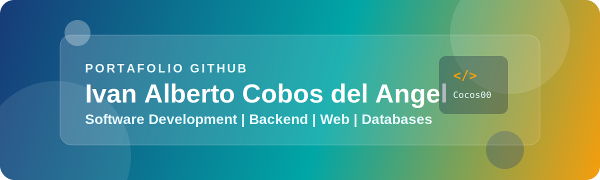

<div align="center">



# Hola, soy Ivan Alberto Cobos del Angel

### Estudiante de Ingenieria en Desarrollo y Gestion de Software

Hidalgo, Mexico | Desarrollo Web | Backend | Bases de Datos | Apps Multiplataforma

[](https://github.com/Cocos00)
[](https://github.com/Cocos00/portfolio-evidencias)
[](#)

</div>

---

## Sobre mi

Soy estudiante de Ingenieria en Desarrollo y Gestion de Software en la Universidad Tecnologica Tula-Tepeji. Me interesa construir soluciones web funcionales, entender la arquitectura de las aplicaciones y mejorar continuamente mis habilidades en backend, bases de datos y desarrollo frontend.

Actualmente trabajo en proyectos academicos y personales con enfoque en:

- Aplicaciones web con interfaces claras y responsivas.
- APIs REST y logica backend.
- Modelado y administracion de bases de datos.
- Control de versiones con Git y GitHub.
- Prototipos IoT con ESP32 y sensores.

---

## Stack tecnico

<div align="center">


</div>

---

## Proyectos destacados

| Proyecto | Descripcion | Evidencia |
|---|---|---|
| [Portafolio de Evidencias](https://github.com/Cocos00/portfolio-evidencias) | Sitio interactivo con proyectos academicos de inventario, ecommerce, banca web e IoT. | HTML, CSS, JavaScript, UI responsiva |
| Sistema de Inventario para PYME | Aplicacion para control de productos, existencias y movimientos. | CRUD, Symfony, bases de datos relacionales |
| Plataforma de Comercio Electronico | Tienda en linea con catalogo, carrito y base para pasarelas de pago. | Frontend, estado de carrito, pagos |
| Dashboard IoT con ESP32 | Prototipo para monitoreo de temperatura y humedad con sensor DHT11. | IoT, visualizacion de datos, APIs |

---

## En que estoy mejorando

```text
Backend        ########..  80%
Frontend       #######...  70%
Bases de datos ########..  80%
Arquitectura   ######....  60%
IoT            #####.....  50%
```

---

## Objetivos profesionales

- Fortalecer mis habilidades como desarrollador junior.
- Participar en practicas profesionales, estadias y proyectos reales.
- Mejorar en arquitectura de software, testing y despliegue.
- Crear soluciones utiles con tecnologias web y backend.

---

## Estadisticas

<div align="center">


</div>

---

## Contacto

- Ubicacion: Hidalgo, Mexico
- GitHub: [Cocos00](https://github.com/Cocos00)
- Portafolio: [portfolio-evidencias](https://github.com/Cocos00/portfolio-evidencias)
- Correo: ivanalberto61@hotmail.com

---

<div align="center">

Gracias por visitar mi perfil.

`Aprendizaje continuo | Trabajo en equipo | Resolucion de problemas`

</div>
